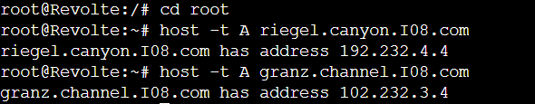
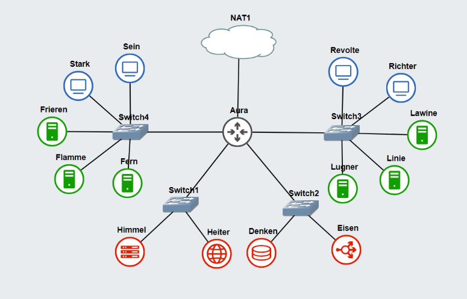
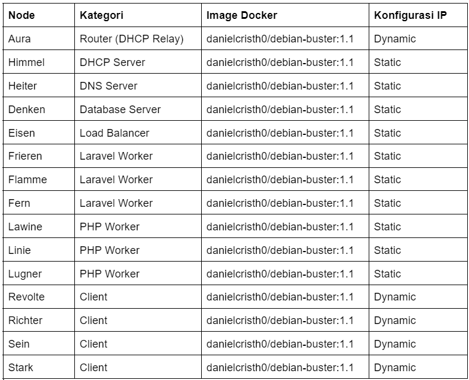
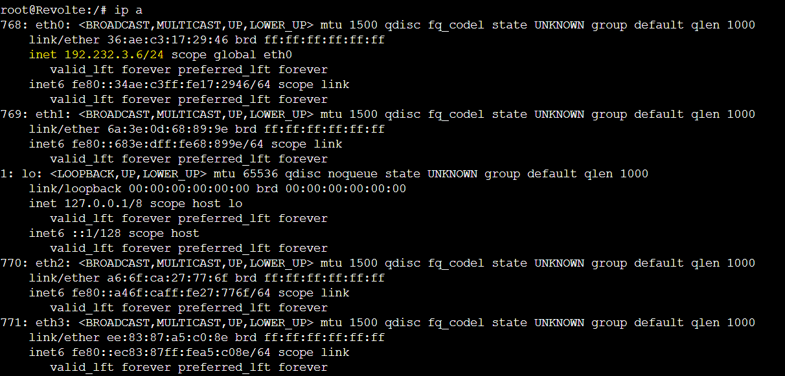

# Jarkom-Modul-3-I08-2023

Nama Anggota | NRP
------------------- | --------------		
Mardhatillah Shevy Ananti | 5025211070
Kirana Alivia Enrico | 5025211190

## Node Configuration
Aura (Router + DHCP Relay)
```
auto eth0
iface eth0 inet dhcp

auto eth1
iface eth1 inet static
	address 192.232.1.1
	netmask 255.255.255.0

auto eth2
iface eth2 inet static
	address 192.232.2.1
	netmask 255.255.255.0

auto eth3
iface eth3 inet static
	address 192.232.3.1
	netmask 255.255.255.0

auto eth4
iface eth4 inet static
	address 192.232.4.1
	netmask 255.255.255.0
```

Himmel (DHCP Server)
```
auto eth0
iface eth0 inet static
	address 192.232.1.2
	netmask 255.255.255.0
	gateway 192.232.1.1
```

Heiter (DNS Server)
```
auto eth0
iface eth0 inet static
	address 192.232.1.3
	netmask 255.255.255.0
	gateway 192.232.1.1
```

Denken (Database Server)
```
auto eth0
iface eth0 inet static
	address 192.232.2.2
	netmask 255.255.255.0
	gateway 192.232.2.1
```

Eisen (Load Balancer)
```
auto eth0
iface eth0 inet static
	address 192.232.2.3
	netmask 255.255.255.0
	gateway 192.232.2.1
```

Revolte (Client)
```
auto eth0
iface eth0 inet dhcp
```

Ritcher (Client)
```
auto eth0
iface eth0 inet dhcp
```

Lawine (PHP Worker) - FIXED ADDRESS
```
auto eth0
iface eth0 inet static
	address 192.232.3.4
	netmask 255.255.255.0
	gateway 192.232.3.1
```

Linie (PHP Worker) - FIXED ADDRESS
```
auto eth0
iface eth0 inet static
	address 192.232.3.5
	netmask 255.255.255.0
	gateway 192.232.3.1
```

Lugner (PHP Worker) - FIXED ADDRESS
```
auto eth0
iface eth0 inet static
	address 192.232.3.6
	netmask 255.255.255.0
	gateway 192.232.3.1
```

Sein (Client)
```
auto eth0
iface eth0 inet dhcp
```

Stark (Client)
```
auto eth0
iface eth0 inet dhcp
```

Frieren (Laravel Worker) - FIXED ADDRESS
```
auto eth0
iface eth0 inet static
	address 192.232.4.4
	netmask 255.255.255.0
	gateway 192.232.4.1
```

Flamme (Laravel Worker) - FIXED ADDRESS
```
auto eth0
iface eth0 inet static
	address 192.232.4.5
	netmask 255.255.255.0
	gateway 192.232.4.1
```

Fern (Laravel Worker) - FIXED ADDRESS
```
auto eth0
iface eth0 inet static
	address 192.232.4.6
	netmask 255.255.255.0
	gateway 192.232.4.1
```

## Soal-0
Kali ini, kalian diminta untuk melakukan register domain berupa riegel.canyon.yyy.com untuk worker Laravel dan granz.channel.yyy.com untuk worker PHP mengarah pada worker yang memiliki IP [prefix IP].x.1.

### Explanation
- Create domain rigel.canyon.I08.com and granz.channel.I08.com in Heiter
```
nano /etc/bind/named.conf.local
```
```
zone "rigel.canyon.I08.com" {
	type master;
	file "/etc/bind/jarkom/rigel.canyon.I08.com";
};

zone "granz.channel.I08.com" {
	type master;
	file "/etc/bind/jarkom/granz.channel.I08.com";
};
```
- Modify the configuration as shown below:
```
nano /etc/bind/jarkom/riegel.canyon.I08.com
```
```
; BIND data file for local loopback interface
;
$TTL    604800
@       IN      SOA     riegel.canyon.I08.com. root.riegel.canyon.I08.com. (
                        2023111301      ; Serial
                        604800          ; Refresh
                        86400           ; Retry
                        2419200         ; Expire
                        604800 )        ; Negative Cache TTL
;
@               IN      NS      riegel.canyon.I08.com.
@               IN      A       192.232.4.4 ; IP Frieren Laravel Worker
```
```
nano /etc/bind/jarkom/riegel.canyon.I08.com
```
```
; BIND data file for local loopback interface
;
$TTL    604800
@       IN      SOA     granz.channel.I08.com.  root.granz.channel.I08.com.  (
                        2023111301      ; Serial
                        604800          ; Refresh
                        86400           ; Retry
                        2419200         ; Expire
                        604800 )        ; Negative Cache TTL
;
@               IN      NS      granz.channel.I08.com.
@               IN      A       102.232.3.4 ; IP Lawine PHP Worker
```

### Testing
- Change IP in /etc/resolv.conf to the IP address of Heiter (DNS Server) and run host -t A to the domain:
```
echo nameserver 10.55.1.2 > /etc/resolv.conf
```


## Soal-1
Lakukan konfigurasi sesuai dengan peta yang sudah diberikan.

### Explanation
- Make the topology based on the picture below:


- Modify the topology with the configuration below:


- Modify configuration for the DHCP Relay (Aura)
```
nano /etc/default/isc-dhcp-relay 
```
- Add this in the configuration:
```
SERVER = "192.232.1.2" #IP Himmel (DHCP Server)
INTERFACES = "eth1 eth2 eth3 eth4"
OPTIONS = ""
```

## Soal-2
Client yang melalui Switch3 mendapatkan range IP dari [prefix IP].3.16 - [prefix IP].3.32 dan [prefix IP].3.64 - [prefix IP].3.80 

### Explanation
- Modify configuration for DHCP Server (Himmel) + fixed address
```
nano /etc/default/isc-dhcp-server
```
- Add this in the configuration:
```
INTERFACES v4 = "eth0"
```
- Modify DHCP configuration
```
nano /etc/dhcp/dhcpd.conf
```
```
subnet 192.232.1.0 netmask 255.255.255.0 {}
subnet 192.232.2.0 netmask 255.255.255.0 {}


subnet 192.232.3.0 netmask 255.255.255.0 {
    range 192.232.3.16 192.232.3.32;
    range 192.232.3.64 192.232.3.80;
    option routers 192.232.3.1;
}
```
- Restart server
```
service isc-dhcp-server restart
```
- Check server status
```
service isc-dhcp-server status
```

## Soal-3
Client yang melalui Switch4 mendapatkan range IP dari [prefix IP].4.12 - [prefix IP].4.20 dan [prefix IP].4.160 - [prefix IP].4.168 

### Explanation
- Same as question 2, Modify DHCP configuration
```
nano /etc/dhcp/dhcpd.conf
```
```
subnet 192.232.1.0 netmask 255.255.255.0 {}
subnet 192.232.2.0 netmask 255.255.255.0 {}


subnet 192.232.3.0 netmask 255.255.255.0 {
    range 192.232.3.16 192.232.3.32;
    range 192.232.3.64 192.232.3.80;
    option routers 192.232.3.1;
}
```
- Restart server
```
service isc-dhcp-server restart
```
- Check server status
```
service isc-dhcp-server status
```

## Soal-4
Client mendapatkan DNS dari Heiter dan dapat terhubung dengan internet melalui DNS tersebut 

### Explanation
- Add the 'broadcast-address' and 'domain-name-servers' options in the dhcpd.conf
```
subnet 192.232.1.0 netmask 255.255.255.0 {}
subnet 192.232.2.0 netmask 255.255.255.0 {}


subnet 192.232.3.0 netmask 255.255.255.0 {
    range 192.232.3.16 192.232.3.32;
    range 192.232.3.64 192.232.3.80;
    option routers 192.232.3.1;
    option broadcast-address 192.232.3.255;
    option domain-name-servers 192.232.1.3;
}

subnet 192.232.4.0 netmask 255.255.255.0 {
    range 192.232.4.12 192.232.4.20;
    range 192.232.4.160 192.232.4.168;
    option routers 192.232.4.1;
    option broadcast-address 192.232.4.255;
    option domain-name-servers 192.232.1.3;
}
```

## Soal-5
Lama waktu DHCP server meminjamkan alamat IP kepada Client yang melalui Switch3 selama 3 menit sedangkan pada client yang melalui Switch4 selama 12 menit. Dengan waktu maksimal yang dialokasikan untuk peminjaman alamat IP selama 96 menit 

### Explanation
- In Himmel, to add duration to the IP lease, additional configuration of 'default-lease-time' and 'max-lease-time' is required in the dhcpd.conf file:
```
subnet 192.232.3.0 netmask 255.255.255.0 {
        range 192.232.3.16 192.232.3.32;
        range 192.232.3.64 192.232.3.80;
        option routers 192.232.3.1;
        option broadcast-address 192.232.3.255;
        option domain-name-servers 192.232.1.3; # DNS Server
        default-lease-time 180;
        max-lease-time 5760;
}

subnet 192.232.4.0 netmask 255.255.255.0 {
        range 192.232.4.12 192.232.4.20;
        range 192.232.4.160 192.232.4.168;
        option routers 192.232.4.1;
        option broadcast-address 192.232.4.255;
        option domain-name-servers 192.232.1.3;
        default-lease-time 720;
        max-lease-time 5760;
}
```
- Restart server
```
service isc-dhcp-server restart
```
- Check server status
```
service isc-dhcp-server status
```
### Testing
- Change IP static to IP dynamic
```
echo '
auto eth0
iface eth0 inet dhcp
' > /etc/network/interfaces
```
- Stop and start Client again, then run the following command:
```
ip a
```


## Soal-6
Pada masing-masing worker PHP, lakukan konfigurasi virtual host untuk website berikut dengan menggunakan php 7.3. 

### Explanation
- Install web server nginx dan php-fpm in each of the PHP worker (Lawine, Linie, Lugner)
```
apt-get update && apt-get install nginx php php-fpm
```
- Configure virtual host in /etc/apache2/sites-available/:
```
<VirtualHost *:80>
    ServerAdmin webmaster@localhost
    ServerName granz.channel.I08.com
    ServerAlias www.granz.channel.I08.com
    DocumentRoot /var/www/granz.channel.yyy.com
    ErrorLog ${APACHE_LOG_DIR}/error.log
    CustomLog ${APACHE_LOG_DIR}/access.log combined
</VirtualHost>
```
- Install PHP:
```
apt-get install php3.7
```
```
php -v
```


## Soal-7
Kepala suku dari Bredt Region memberikan resource server sebagai berikut:
a. Lawine, 4GB, 2vCPU, dan 80 GB SSD.
b. Linie, 2GB, 2vCPU, dan 50 GB SSD.
c. Lugner 1GB, 1vCPU, dan 25 GB SSD.
aturlah agar Eisen dapat bekerja dengan maksimal, lalu lakukan testing dengan 1000 request dan 100 request/second. 

### Explanation

## Soal-8
### Explanation

## Soal-9
### Explanation

## Soal-10
### Explanation
